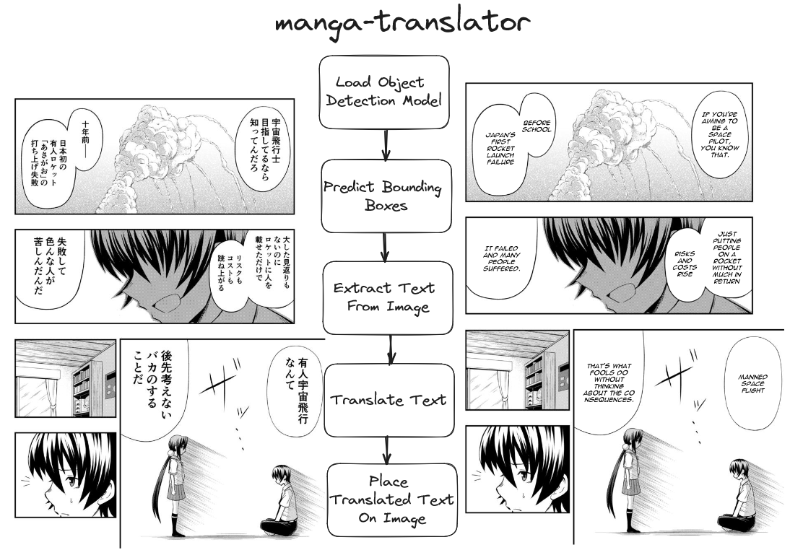

# TRUEslator - Tradutor de Mangá

Créditos originais para [@Detopall](https://github.com/Detopall)

## Índice

- [TRUEslator - Tradutor de Mangá](#trueslator---tradutor-de-mangá)
  - [Índice](#índice)
  - [Introdução](#introdução)
  - [Funcionalidades](#funcionalidades)
  - [Arquitetura](#arquitetura)
    - [Detecção de Balões de Fala (YOLOv8)](#detecção-de-balões-de-fala-yolov8)
    - [Reconhecimento de Texto (Manga-OCR)](#reconhecimento-de-texto-manga-ocr)
    - [Tradução de Texto (Microsoft Translator)](#tradução-de-texto-microsoft-translator)
    - [Renderização de Texto](#renderização-de-texto)
  - [Instalação](#instalação)
  - [Configuração](#configuração)
  - [Uso](#uso)
  - [API](#api)
  - [Validação e Métricas](#validação-e-métricas)
  - [Contribuição](#contribuição)

## Introdução

O TRUEslator é uma ferramenta para tradução automática de mangás japoneses para outros idiomas. O projeto visa permitir a leitura de capítulos recém-lançados de mangás sem a necessidade de esperar por traduções oficiais ou feitas por fãs.

## Funcionalidades

- Detecção automática de balões de fala em páginas de mangá
- Reconhecimento de texto japonês (e outros idiomas asiáticos)
- Tradução de texto para português, inglês e outros idiomas
- Interface web para upload e visualização de mangás traduzidos
- API para integração com outros sistemas
- Sistema de validação para avaliar a qualidade das traduções

## Arquitetura

O TRUEslator utiliza um pipeline de processamento que consiste em quatro etapas principais:



### Detecção de Balões de Fala (YOLOv8)

O primeiro passo é identificar onde estão os balões de fala nas páginas do mangá. Para isso, utilizamos o YOLOv8, um modelo de detecção de objetos em tempo real. O modelo foi treinado com um dataset contendo mais de 8.500 imagens de páginas de mangá com anotações de balões de fala.

O dataset utilizado está disponível no [Roboflow](https://universe.roboflow.com/speechbubbledetection-y9yz3/bubble-detection-gbjon/dataset/2#) e contém aproximadamente 1,7GB de dados.

### Reconhecimento de Texto (Manga-OCR)

Após identificar os balões de fala, utilizamos o Manga-OCR para extrair o texto contido neles. O Manga-OCR é uma biblioteca Python especializada em reconhecimento óptico de caracteres para texto japonês em mangás, o que o torna ideal para nossa aplicação.

### Tradução de Texto (Microsoft Translator)

O texto extraído é então traduzido utilizando o Microsoft Translator API. A implementação atual suporta tradução de japonês para português, inglês e outros idiomas. O sistema também detecta automaticamente se o texto já está em caracteres ocidentais (romanizados) para evitar traduções desnecessárias.

### Renderização de Texto

Finalmente, o texto traduzido é renderizado de volta na imagem, dentro dos balões de fala originais. O sistema utiliza fontes específicas para mangás e ajusta automaticamente o tamanho e posicionamento do texto para se adequar ao espaço disponível.

## Instalação

1. Clone o repositório:
   ```bash
   git clone https://github.com/seu-usuario/TRUEslator.git
   cd TRUEslator
   ```

2. Instale as dependências:
   ```bash
   pip install -r requirements.txt
   ```

3. Baixe as fontes necessárias para a pasta `fonts/`:
   - mangat.ttf
   - GL-NovantiquaMinamoto.ttf
   - fonts_animeace_i.ttf

## Configuração

1. Crie um arquivo `.env` na raiz do projeto com sua chave de API do Microsoft Translator:
   ```
   MICROSOFT_API_KEY=sua_chave_api_aqui
   MICROSOFT_REGION=brazilsouth
   ```

2. (Opcional) Se você quiser treinar seu próprio modelo YOLOv8, baixe o dataset mencionado acima e siga as instruções no notebook `model_creation/main.ipynb`.

## Uso

1. Inicie o servidor web:
   ```bash
   python app.py
   ```

2. Acesse a interface web em `http://localhost:8000`

3. Faça upload de uma imagem de mangá e aguarde o processamento

4. Visualize e baixe a imagem traduzida

## API

O TRUEslator também oferece uma API REST para integração com outros sistemas:

```
POST /predict
{
  "image": "base64_encoded_image"
}
```

A resposta será um JSON contendo a imagem traduzida em base64 e informações sobre o texto detectado e traduzido:

```json
{
  "image": "base64_encoded_image",
  "image_info": {
    "detected_language": "ja",
    "translated_language": "pt",
    "bounding_boxes": [...],
    "text": [...],
    "translated_text": [...]
  }
}
```

## Validação e Métricas

O TRUEslator inclui um sistema de validação para avaliar a qualidade das traduções. As métricas incluem:

- Taxa de detecção de texto (percentual de regiões de texto corretamente identificadas)
- Qualidade da tradução (usando o score BLEU)
- Precisão da detecção de balões de fala (usando IoU - Intersection over Union)

Para executar a validação em um conjunto de imagens de teste:

```bash
 python validation_example.py
```

## Contribuição

Contribuições são bem-vindas! Sinta-se à vontade para abrir issues ou enviar pull requests com melhorias para o projeto.